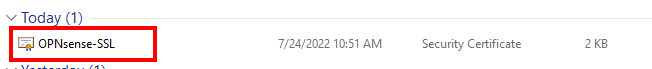
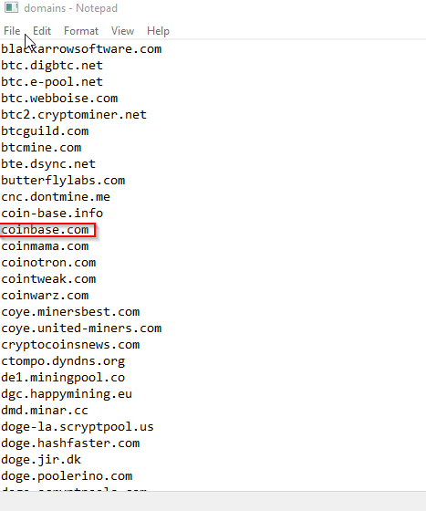
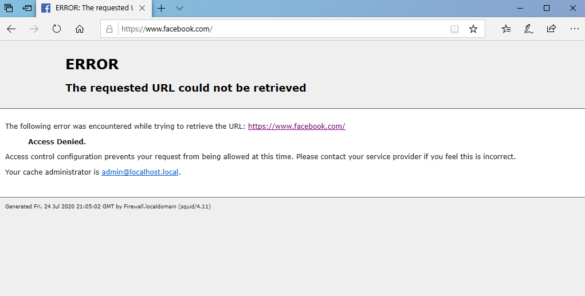

# Configuring Web Proxy in OPNsense
 
In this lab, I successfully configured the Web Proxy in OPNsense within
a multi-LAN virtual environment, aiming to enhance network security and
control web traffic effectively.

**Requirements:**

- Multi LAN Virtual Environment from Lab 3.0

- 2 Windows 10 client PCs

- OPNsense Firewall configured with 2 LAN interfaces

**Step 1: Block Proxy Bypass**

I initiated the configuration by adding a crucial rule to the firewall,
preventing any unauthorized web traffic on the guest network to ensure
proxy bypass prevention. The use of the '**All_Web_Traffic**' alias
streamlined the process, addressing both HTTP and HTTPS traffic without
the need for separate rules.

1.  I navigated to Firewall \> Rules.

2.  Selected 'GuestNetwork'.

3.  Implemented the addition of a new firewall rule by clicking the plus
    sign.

Configuration Details:

- **Action:** Block

- **Protocol:** TCP\UDP

- **Source:** GuestNetwork net

- **Destination Port Range:** All_Web_Traffic

- **Logging:** Enabled

- **Description:** Block Proxy Bypass

>  style="width:5.65972in;height:4.09967in" />

After configuring the rule, I prioritized its position by moving it to
the top of the list. This ensured the immediate implementation of the
rule, and to solidify the changes.

I applied them by clicking the arrow on the first rule and executing the
'Apply changes' action.

This strategic blocking mechanism establishes a robust defense against
potential proxy bypass attempts on the guest network.

**Step 2: Configuring Web Proxy Redirection**

Continuing with the meticulous configuration of the Web Proxy, I
executed the following steps to ensure effective redirection and proxy
management:

I accessed the Opnsense Web Proxy administration panel under "Services
\> Web Proxy \> Administration" and enabled full help for comprehensive
guidance. In the Forward Proxy tab, I selected only "GuestNetwork" as
the proxy interface, ensuring it operates specifically within that
network. To maintain transparency, I enabled the transparent HTTP proxy.

After configuring these settings, I applied them to make sure they took
effect.

For controlling web traffic on the GuestNetwork, I created a new
firewall rule.

Going into advanced settings, I specified the interface as
"GuestNetwork," the source as "GuestNetwork net," and enabled NAT
Reflection for proper network address translation.

After saving the settings, I applied the changes.

In the progression of the configuration, I addressed the security of web
traffic by activating SSL inspection. This crucial step ensures that
even encrypted HTTPS traffic is inspected for potential threats or
policy violations. To accommodate this security measure, I added a new
firewall rule, replicating the configuration used for HTTP traffic.

Ensuring the effectiveness of the configured rules, I meticulously
checked the firewall settings under "Firewall \> Nat \> Port Forward."
This step was crucial to confirm that the rules for port forwarding,
particularly for both HTTP and HTTPS, were successfully implemented. The
verification process adds an extra layer of assurance that the network
is appropriately set up to forward traffic to the proxy, maintaining
security and compliance standards.

Returning to the Forward Proxy tab, I initiated the process of
establishing a Certificate Authority (CA) by navigating to CA Manager.

In this step, I added a new CA with the name "Opnsense-SSL" and selected
the method "Create an internal Certificate Authority."

After providing the necessary Distinguished name information, I saved
the configuration.

Subsequently, I exported the CA certificate and ensured its successful
download.

To make this certificate accessible on Guest PC2, I copied and pasted it
onto the desktop. In case standard copy/paste methods were unavailable,
I utilized the drag and drop feature from PC1 to PC2 desktop.

Alternatively, if both copy/paste and drag and drop were non-functional,
I employed the Remote Desktop Protocol (RDP) feature. By opening the
Remote Desktop Connection on PC1 and connecting to PC2 with the
specified IP address (e.g., 192.168.3.10), I facilitated the secure
transfer of the certificate.

The provided credentials, including the username "perscholas" and
password "Ps@12345," ensured successful authentication.

The next step involved copying the certificate from PC1 (CTRL + C) and
pasting it into the remote computer (PC2) using (CTRL + V).

On PC2, I opened the Opnsense SSL CA folder, clicked on "Install
certificate," and followed the prompted steps.

During installation, I selected "Local Machine" and designated the
Trusted Root Certificate Authorities store for the certificate.

The successful completion of this process was confirmed by the
appearance of the final window. Finally, I clicked "Finish" to conclude
the installation.

Returning to the Forward Proxy tab, I proceeded to configure the
Certificate Authority (CA) for use. Specifically, I selected the
previously created "OPNsense-SSL" CA and applied the changes.

To streamline user access and maintain simplicity, I navigated to the
arrow next to Forward Proxy and accessed Authentication Settings.

Here, I ensured that authentication was disabled by clicking on "Clear
All" for both options and subsequently applying the changes.

Concluding this phase, I activated the proxy by clicking on "Enable" and
applying the changes.

Returning to the Forward Proxy tab, I initiated the setup for web
filtering by accessing Remote Access Control Lists and adding a new
list.

The configurations included enabling the list, providing a URL link for
the UT1 web categorization list, and saving the settings.

After downloading and applying the Access Control Lists (ACLs), I
navigated to the Edit button, where I selected specific categories for
filtering, such as "bitcoin." Subsequently, I reapplied the ACLs to
implement the chosen categories.

To verify the effectiveness of the web filter, I accessed Guest PC2 and
tested general web traffic by visiting Google, followed by a search for
"bitcoin." Attempting to access coinbase.com, I observed a denial due to
the implemented web filtering.

Proceeding to customize the blocklist, I visited the Forward Proxy
settings and accessed the Access Control List.

I added custom sites like facebook.com and worldstarhiphop.com to the
blacklist, ensuring their successful blocking.

Concluding the project with the caching proxy configuration, I accessed
Services \> Web Proxy \> Administration.

Navigating to General Proxy Settings and selecting Local Cache Settings,
I configured caching options with considerations for memory cache size
and the enabling of local cache. While demonstrating the caching proxy
setup, it's important to note that caching was enabled for demonstration
purposes only.

This wraps up the detailed configuration of the web proxy in Opnsense,
covering web filtering, testing, custom blocking, and caching proxy
settings.

